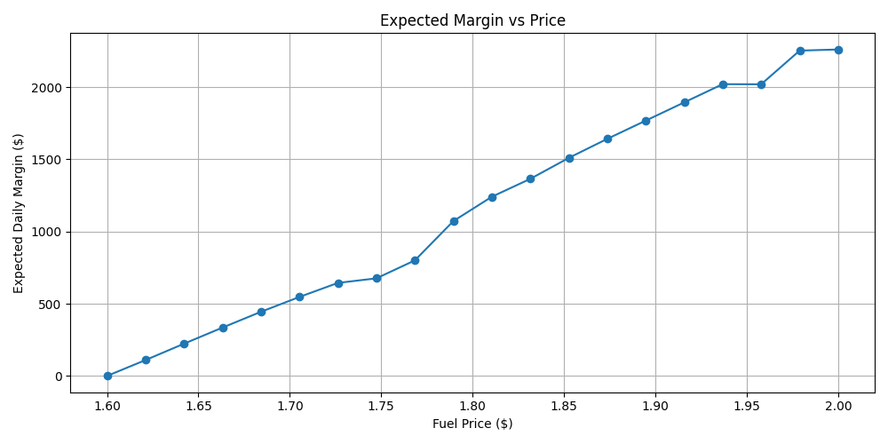
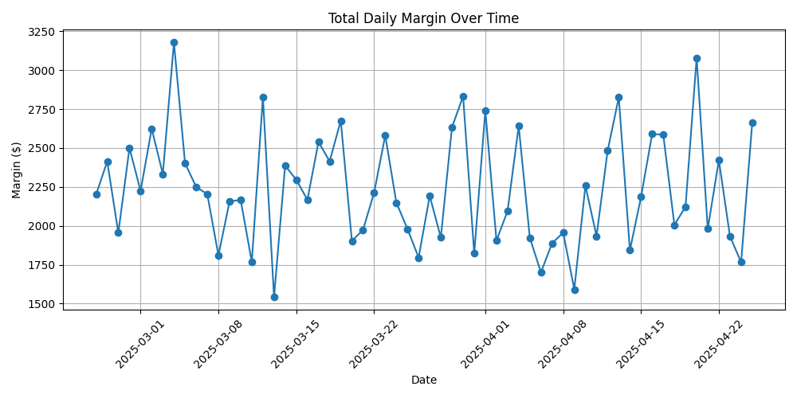
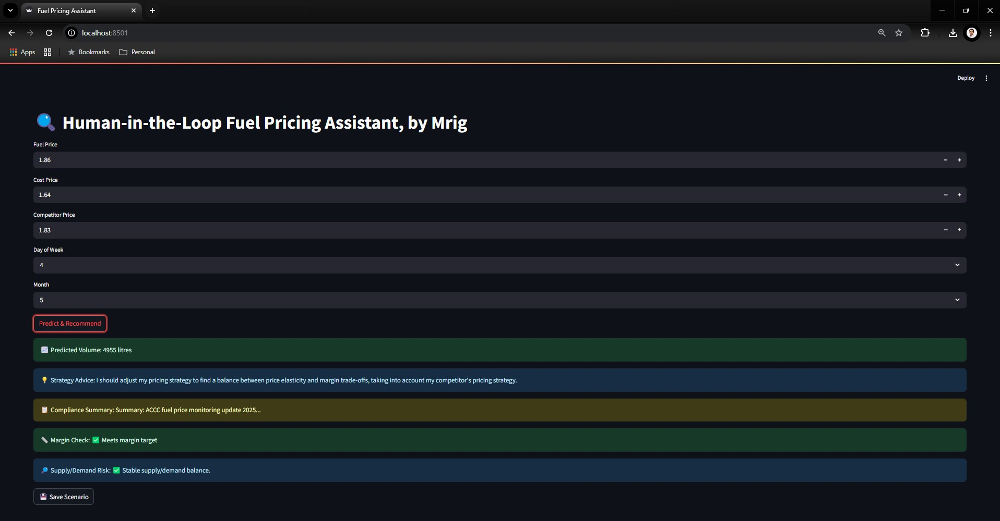
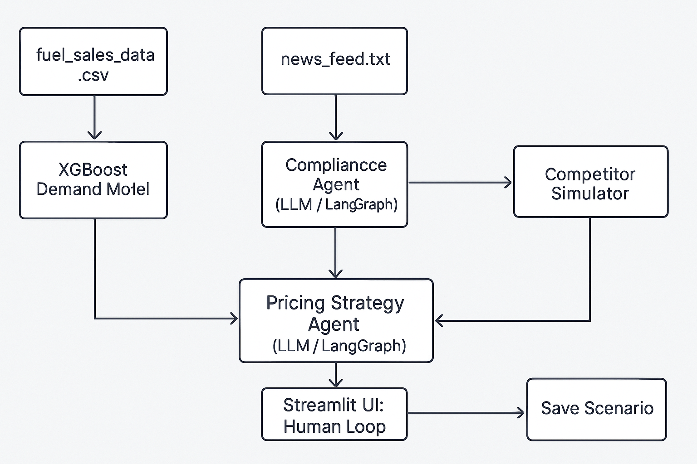
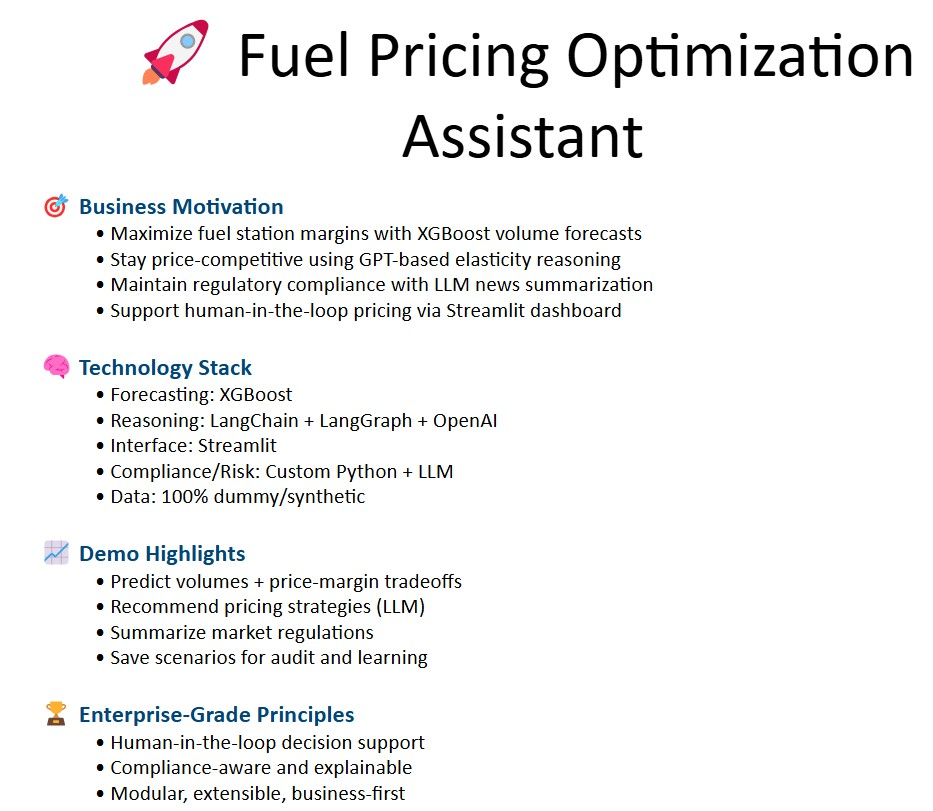

# ⛽ Fuel Pricing Optimization Assistant – LLM x ML x LangGraph

> A human-in-the-loop AI system for forecasting fuel demand, recommending pricing strategies, and checking compliance — built with OpenAI, LangChain, LangGraph, XGBoost, and Streamlit.





---

## 🚀 Overview

This is a modular, enterprise-grade AI pricing assistant inspired by real-world retail fuel pricing use cases. The system combines machine learning with reasoning agents to simulate and support data-driven pricing decisions.

---

## 🎯 Business Value

| Objective                        | Solution                                                             |
|----------------------------------|----------------------------------------------------------------------|
| Maximize fuel margins            | Forecast demand using XGBoost and optimize price-to-volume tradeoff  |
| Stay competitive with pricing    | Agent-based strategy guidance based on elasticity and competitors    |
| Ensure regulatory compliance     | LLM agent summarizes market/compliance news                          |
| Support human decision makers    | Streamlit UI for simulation and scenario saving                      |

💡 **Estimated Impact**: +$2M annual uplift (modeled across 500 service stations)  
📢 **Note**: This demo is built using 100% dummy (synthetic) data

---

## 🧠 System Architecture

```
[ fuel_sales_data.csv ]                [ news_feed.txt ]
         |                                    |
         v                                    v
[ XGBoost Demand Model ]        [ Compliance Agent (LLM) ]
         |                                    |
         v                                    v
[ Pricing Strategy Agent (LLM / LangGraph) ] -----> [ Competitor Simulator ]
         |                                    |
         v                                    v
     [ Streamlit UI: Human Loop ] <---------- [ Save Scenario ]
```

---

## 🛠️ Tech Stack

| Component        | Tech                                    |
|------------------|-----------------------------------------|
| Forecasting      | XGBoost, Scikit-learn                   |
| Reasoning Agents | LangChain, LangGraph, OpenAI GPT-4      |
| Orchestration    | LangGraph (stateful tool invocation)    |
| Interface        | Streamlit                               |
| Visualization    | Matplotlib                              |
| Tracking         | MLflow                                  |
| Packaging        | Python, venv                            |

---

## 📊 Features

- 📈 Predict fuel demand at different prices
- 💡 GPT-based strategy suggestions (elasticity, competitors, margin)
- 📋 Compliance agent for summarizing ACCC-style fuel news
- 🔁 Simulate competitor response to pricing changes
- 📊 Visualize margin trends and price-volume tradeoffs
- 💾 Save and audit scenarios for pricing reviews
- 🧠 LangGraph-based reasoning agent (modular & memory-ready)


---

## 🧪 Run Locally

### 1. Clone the repo

```bash
git clone https://github.com/mnds18/fuel-pricing-assistant.git
cd fuel-pricing-assistant
```

### 2. Create & activate virtual environment

```bash
python -m venv .venv
source .venv/bin/activate  # Windows: .venv\Scripts\activate
```

### 3. Install dependencies

```bash
pip install -r requirements.txt
```

### 4. Train model + generate outputs

```bash
python scripts/orchestrate_all.py --launch-ui
```

### 5. Launch UI separately

```bash
streamlit run app/human_loop_app.py
```

---

## 📂 Project Structure

```
📁 agents/
📁 app/
📁 data/
📁 models/
📁 scripts/
📁 utils/
📁 docs/
```

---

## ✍️ Author

Built by [Mrig](https://www.linkedin.com/in/mrigendranath/)  
🎯 Inspired by real-world pricing systems in Australia's energy sector


---

## 📢 License

MIT — Free to reuse and adapt with attribution.